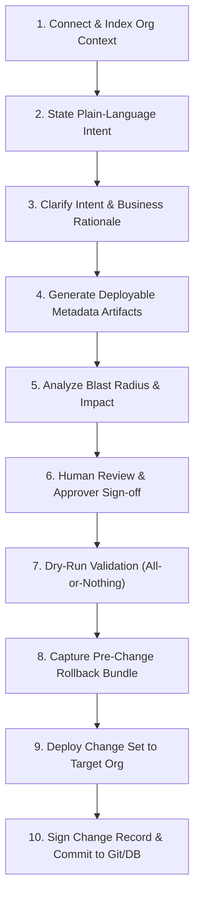

# OrgForge PRD (imported)

> **Source:** `../OrgForge/docs/architecture/PRD.md` — copied **verbatim** for the
> unified Forge docs set. This is the legacy product requirements document the
> **Org Changes** capability must satisfy. Compliance status lives in
> [`PRD_COMPLIANCE.md`](../PRD_COMPLIANCE.md).
>
> **Docs set (one product):** [`unification_plan.md`](../unification_plan.md) (design) · [`DECISIONS.md`](../DECISIONS.md) (decisions) · [`IMPLEMENTATION_PLAN.md`](../IMPLEMENTATION_PLAN.md) (tracker) · [`api_contract.md`](../api_contract.md) (frozen API) · [`PRD.md`](../PRD.md) (unified requirements) · [`API.md`](../API.md) (reference) · [`APP_FLOW.md`](../APP_FLOW.md) (flows) · [`TECH_STACK.md`](../TECH_STACK.md) (stack) · [`DESIGN.md`](../DESIGN.md) (design system) · [`PHASE5_PLAN.md`](../PHASE5_PLAN.md) (phase 5)

---

# OrgForge: Product Requirements Document (PRD)

> **Document Version:** v1.0 (SaaS & Multi-Tenant Evolution)  
> **Status:** Approved for Engineering Scoping  
> **Owner:** Dhananjay Goel, Founder and CEO, Enlight Lab  
> **Foundation:** `forcedotcom/sf-skills` (Apache 2.0) + Enlight Lab Governance Overlay Skills  
> **Related Products:** AgentForge (Agentforce Builder), AgentScore (Agentforce Audit)

---

## 1. Executive Summary

Every Salesforce org accumulates customization debt faster than any team can safely govern. Fields, validation rules, flows, permission sets, and layouts are changed by admins, contractors, and now AI copilots, in a system where a single formula edit can silently break a revenue integration. Existing release management tools gate deployments on process without understanding business intent, while standard generation tools write XML without understanding consequences.

**OrgForge closes that gap.** It is a skills-grounded AI customization and change governance engine. It takes plain-language customization requests, grounds itself in the target Salesforce org schema, generates deployable metadata using the official Salesforce Skills Library, proves the blast radius with a dependency and data impact brief, and then either deploys behind a dry run or **refuses with a plain-language reason**.

OrgForge is positioned as the general customization counterpart to AgentForge. AgentForge builds Agentforce conversational agents; OrgForge edits the org itself (custom objects, fields, validation rules, value sets, permission sets, sharing, flows, page layouts, Apex, and LWCs).

```
┌─────────────────────────────────────────────────────────────────────────┐
│ Positioning in one line:                                                │
│ OrgForge is the only Salesforce customization agent that treats a       │
│ refusal as a successful outcome. It ships a change record, not a change.│
└─────────────────────────────────────────────────────────────────────────┘
```

---

## 2. Problem Statement

### 2.1 What breaks today
1. **Invisible Dependency Chains**: A field is renamed or picklist value removed. Formulas, report types, flows, Apex, and outbound API integrations fail at runtime rather than deploy time.
2. **Retroactive Validation**: A new validation rule is deployed against an object with existing records that violate it. Subsequent edits fail silently in support queues weeks later.
3. **Permission Drift**: Permission sets and sharing rules are edited to unblock one user, quietly widening access for populations nobody audited.
4. **Undocumented Change**: The engineer who made a change leaves, the reason was never written down, and org governance relies on fragile tribal knowledge.

---

## 3. Product Definition & Scope

### 3.1 What OrgForge is
OrgForge is a multi-tenant SaaS application powered by Next.js 16, Supabase Auth, and a dedicated OrgForge Salesforce External Client App (ECA). It uses `forcedotcom/sf-skills` as its grounding layer for metadata correctness and adds an Enlight Lab governance overlay layer (`orgforge-*`) for impact analysis, refusal gates, tamper-evident change records, and single-command rollback.

### 3.2 In Scope (v1)
- **Declarative Metadata**: Custom objects, custom fields, validation rules, value sets, record types, page layouts, Lightning record pages, list views, custom tabs, custom apps, custom report types.
- **Access Metadata**: Permission sets, field-level security, organization-wide defaults (OWD), sharing rules.
- **Automation**: Record-triggered, screen, scheduled, and autolaunched flows.
- **Code**: Apex classes, triggers, and test classes; Lightning Web Components (LWC).
- **Governance**: Org context retrieval, dry-run validation, blast-radius dependency analysis, refusal gate evaluation, dry-run deployment, and single-command rollback.
- **Production Posture**: Production deployment behind an explicit named-approver gate.
- **Audit & Records**: Machine-readable JSON and human-readable Markdown Change Records committed to `orgforge-changes/` in Git and indexed in Supabase PostgreSQL (`orgforge` schema).

### 3.3 Explicitly Out of Scope (v1)
- Data migration, bulk record manipulation, and data cleanup jobs.
- Agentforce agent authoring (*handled by AgentForge*).
- Managed package development and AppExchange security review workflows.
- Industry Cloud / CPQ / OmniStudio / Data Cloud metadata (deferred to v2).

---

## 4. The 5 Hard Rules

> [!IMPORTANT]
> **Hard Rule 1: No Silent Org Changes**  
> OrgForge shall never write to a Salesforce org without producing a complete change record containing the intent, generated artifacts, skills/versions used, impact brief, gate results, dry-run outcome, deployment identifier, and rollback bundle reference.

> [!IMPORTANT]
> **Hard Rule 2: No Confident Wrong Answers**  
> OrgForge shall generate metadata only from retrieved, live org context and pinned skill definitions. It shall never infer the existence of an object, field, or relationship. Where context is missing, OrgForge refuses and states precisely what is missing.

> [!IMPORTANT]
> **Hard Rule 3: Zero-Trust Multi-Tenant Isolation**  
> Customer org credentials and access tokens shall be encrypted at rest using AES-256-GCM in the dedicated `orgforge` database schema, guarded by Supabase Auth and Row-Level Security (RLS). Org metadata and credentials shall never be shared across tenants.

> [!IMPORTANT]
> **Hard Rule 4: Pinned Upstream Skills**  
> Upstream skills from `forcedotcom/sf-skills` shall be pinned to specific commits. OrgForge shall record the commit hash in every change record and shall quarantine unreviewed upstream updates.

> [!IMPORTANT]
> **Hard Rule 5: Refusal is a First-Class Outcome**  
> A refusal shall never be presented as a failure of OrgForge. Every refusal states the plain-language reason, missing evidence, and human unblock action. OrgForge shall never soften, bypass, or downgrade a gate in response to operator insistence.

---

## 5. Refusal Taxonomy (REF-01 to REF-10)

| Refusal Code | Condition | Plain-Language Message | Unblock Path |
| :--- | :--- | :--- | :--- |
| **REF-01** | Dependency or data analysis incomplete | *"I could not confirm what else uses this. Named source was unavailable."* | Restore access to source or record named approver override |
| **REF-02** | Dry-run validation failed | *"The org rejected this change during validation."* | Correct artifact and revalidate |
| **REF-03** | Static analysis blocking violation | *"Generated code violates a blocking static analysis rule."* | Regenerate or get security approver override |
| **REF-04** | Access/sharing change without approver | *"This change alters who can see data. I need a named approver."* | Record named approver identity |
| **REF-05** | Existing records invalidated by constraint | *"Stated number of existing records would fail this rule."* | Choose remediation option or scope rule to new records |
| **REF-06** | No rollback bundle or unacknowledged irreversibility | *"I cannot undo this. Confirm you accept that before I proceed."* | Acknowledge irreversibility or capture rollback bundle |
| **REF-07** | Production target without production mode | *"This is a production org. Production mode is not enabled."* | Enable production mode and record approver |
| **REF-08** | Target component in managed package | *"This component belongs to a managed package and cannot be edited."* | Use supported extension point or contact publisher |
| **REF-09** | Skill library commit drift | *"My skill library no longer matches the pinned commit."* | Reinstall pinned commit or complete drift review |
| **REF-10** | Ambiguous intent | *"Your request matches more than one component. I will not guess."* | Specify exact target component |

---

## 6. 10-Stage Linear Operator Workflow



---

## 7. Functional Requirements Overview (48 SHALL Statements)

The system enforces 48 formal requirements organized into 8 core capability groups:
- **Group 1: Org Grounding & Context (FR-1 to FR-6)**: Live org schema retrieval, context indexing, freshness thresholds, namespace protection.
- **Group 2: Intent Capture & Clarification (FR-7 to FR-11)**: Plain-language intent parsing, mandatory business rationale, dependency ordering, human artifact editing.
- **Group 3: Metadata Generation (FR-12 to FR-18)**: Skill resolution, source-format output, API name derivation, Apex test generation, Mermaid diagram generation.
- **Group 4: Impact & Dependency Analysis (FR-19 to FR-25)**: Dependency briefs, record violation counts, permission impact, integration impact, blast radius classification (Low, Medium, High, Blocked).
- **Group 5: Refusal Gates (FR-26 to FR-35)**: Gate enforcement for incomplete analysis, dry-run failure, static analysis errors, unapproved access edits, record invalidation, production targets.
- **Group 6: Validation & Deployment (FR-36 to FR-40)**: Dry-run validation execution, test level selection, plain-language error translation, ECA transport, Git commit generation in `orgforge-changes/`.
- **Group 7: Change Record & Audit Trail (FR-41 to FR-45)**: Change record assembly, refusal change records, machine/human export formats, tamper-evident SHA-256 signing, historical querying.
- **Group 8: Rollback & Recovery (FR-46 to FR-48)**: Pre-change snapshot capture, single-command revert, irreversibility warnings.
